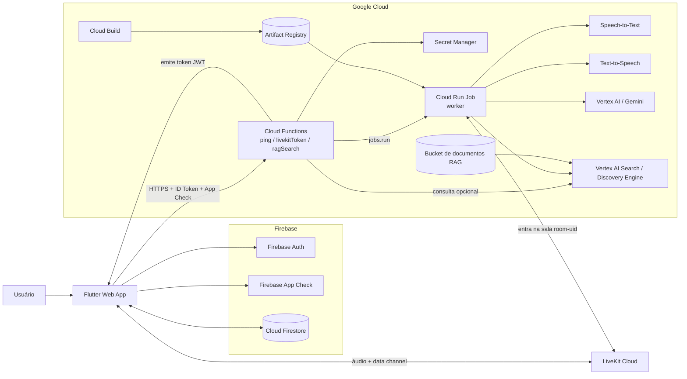

# Arquitetura da Solução

## Visão geral

## Aplicações

- `Flutter Web App`: cliente demonstrador usado para autenticação, conexão LiveKit, envio de `chat_context` e `scene_event`, exibição do chat e persistência opcional em Firestore.
- `Cloud Functions`: camada HTTP protegida por Firebase Auth + App Check. Expõe `ping`, `livekitToken` e `ragSearch`.
- `Cloud Run Job (worker)`: entra dinamicamente na sala LiveKit e executa a pipeline `VAD -> STT -> Gemini/RAG -> TTS`.
- `LiveKit Cloud`: transporte em tempo real para áudio e mensagens via data channel.

## Persistências

- `Cloud Firestore`: histórico de chats e mensagens do usuário.
- `Cloud Storage / bucket RAG`: documentos fonte usados pelo Discovery Engine.
- `Artifact Registry`: imagem container do worker.
- `Secret Manager`: credenciais sensíveis de integração, especialmente segredos do LiveKit.

## Fluxo principal

1. O cliente Web autentica no Firebase e obtém `ID Token` + `App Check`.
2. O cliente chama `ping` para validar o backend.
3. O cliente chama `livekitToken`.
4. A Function emite o JWT do LiveKit e dispara o `Cloud Run Job` do worker para a sala `room-<uid>`.
5. O cliente entra na sala do LiveKit e publica microfone.
6. O worker entra na mesma sala, consome o áudio, executa `STT -> Gemini (+ RAG) -> TTS`.
7. O worker devolve eventos de status, transcrição e resposta via data channel, além do áudio sintetizado na trilha `assistant`.
8. O cliente persiste o histórico em Firestore quando necessário.

## Observações de escopo

- Esta arquitetura documenta o escopo atual compartilhável: `voz + chat + RAG`.
- O cliente Web envia `scene_event` apenas textual.
- O repositório compartilhado não expõe a funcionalidade futura de envio de imagem.
